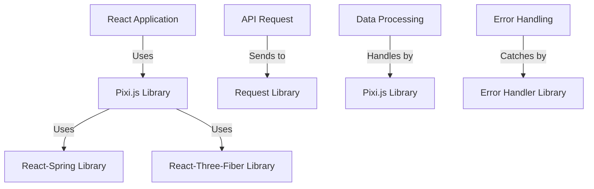

A treasure trove of source files!

These files appear to be related to a React-based project, specifically:

1. `package.json`: This file contains metadata about the project, including dependencies, scripts, and configuration settings.
2. `package-lock.json` (not shown): This file is generated by npm when you install packages with `npm install`. It locks down the versions of your dependencies to ensure consistent behavior across different environments.

The contents of these files suggest that this project uses:

* React (16.10.2) and React DOM (16.10.2)
* Pixi.js (5.1.5) for graphics rendering
* react-spring (8.0.27) for animation
* react-three-fiber (3.0.2) for 3D rendering
* request (2.88.0) for making HTTP requests

The project also uses various ESLint configurations, including the "react-app" preset.

The `package.json` file specifies three scripts:

1. `start`: Runs the application with `react-scripts start`
2. `build`: Builds the application with `react-scripts build`
3. `test`: Runs tests with `react-scripts test`
4. `eject`: Ejects the project configuration with `react-scripts eject`

Overall, this appears to be a React-based project that uses various libraries and tools for building a graphical user interface (GUI).

_Generated by P4CodexIQ

## Architecture Diagram

_Generated by P4CodexIQ