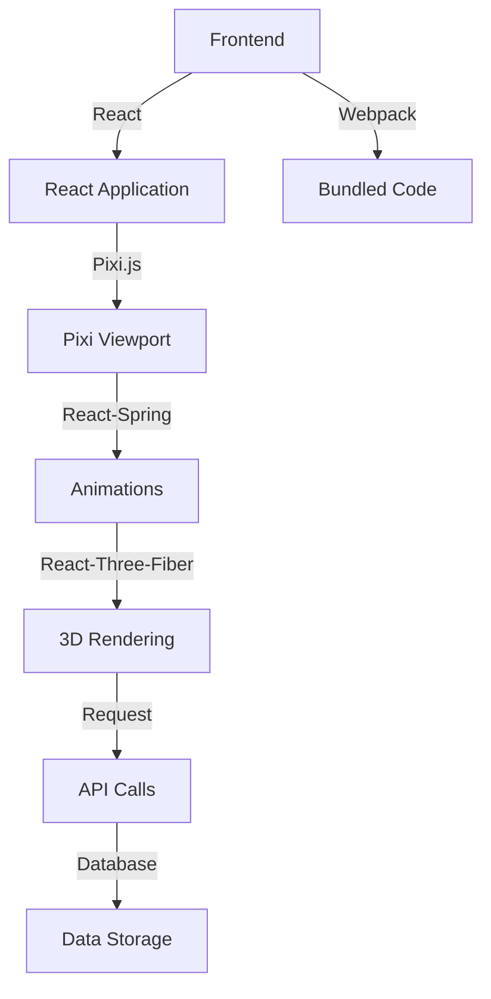

A massive JSON file!

It appears to be the `package.json` file for a React application, specifically a NASA-themed client-side app. Here are some key takeaways:

**Dependencies:**

* A variety of libraries and frameworks are listed as dependencies:
	+ React and its related components (e.g., `react-dom`)
	+ Pixi.js (a JavaScript library for creating interactive graphics)
	+ Pixi-viewport (an extension for Pixi.js that provides a viewport component)
	+ React-spring (a library for animating React components)
	+ React-three-fiber (a library for rendering 3D graphics in React)
	+ Request (a HTTP request library)

**Scripts:**

* The `start` script starts the development server using `react-scripts start`.
* The `build` script builds the application using `react-scripts build`.
* The `test` script runs tests using `react-scripts test`.
* The `eject` script ejects the project from Create React App, allowing for more customization.

**ESLint Config:**

* The ESLint configuration extends the "react-app" preset, which provides a set of rules and configurations specific to React applications.

**Browserslist:**

* The browserslist configuration specifies which browser versions are supported in production (modern browsers) and development environments (last 1 version of Chrome, Firefox, and Safari).

This file likely serves as the foundation for a NASA-themed web application using React, Pixi.js, and other libraries.

_Generated by P4CodexIQ

## Architecture Diagram

_Generated by P4CodexIQ